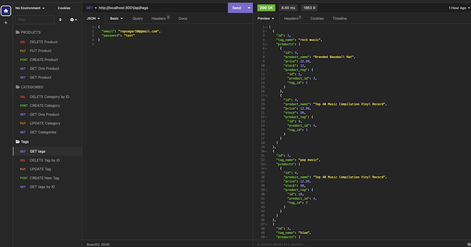
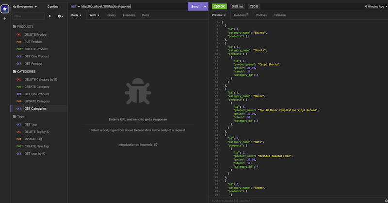
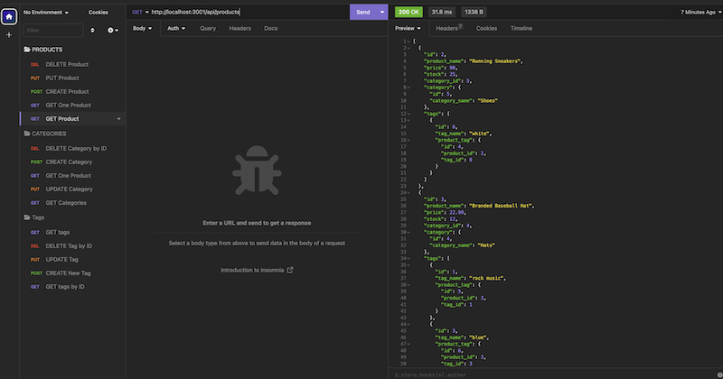

## E-NodeCommerce

  
## Description 

Challenge is to build the back end for an e-commerce site. You’ll take a working Express.js API and configure it to use Sequelize to interact with a MySQL database

### App working example
[Video Link](https://drive.google.com/file/d/15UMQZIaq3aI1nr72xv_BR-rsFZvTV7UU/view)

## User Story
AS A manager at an internet retail company
I WANT a back end for my e-commerce website that uses the latest technologies
SO THAT my company can compete with other e-commerce companies

## Table of contents

- [Description](#description)
- [Installation](#installation)
- [Usage](#usage)
- [license](#license)
- [Contributors](#contributors)
- [Tests](#tests)
- [Repository Link](#repository)
- [Questions](#questions)

## Installation
To install necesary dependencies, run the following command:

        npm i

## Usage

        npm start

## license

## Contributors

https://github.com/rgadewar

## Tests
To run tests, run the following command:

          npm test

## Questions
If you have any questions about the repo, open an issue or contact me directly at email rupa@gadewar.com. You can find more of my work at
https://www.github.com/rgadewar

## Repository

- [Project Repo](https://github.com/rgadewar/E-NodeCommerce)
